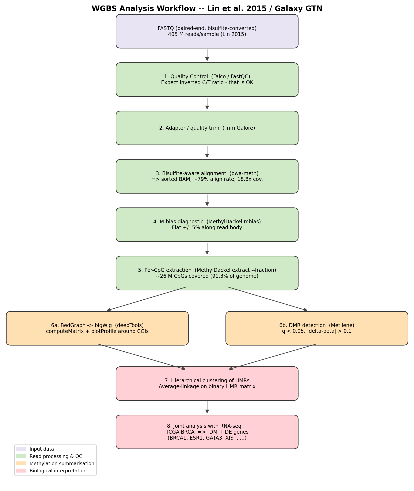
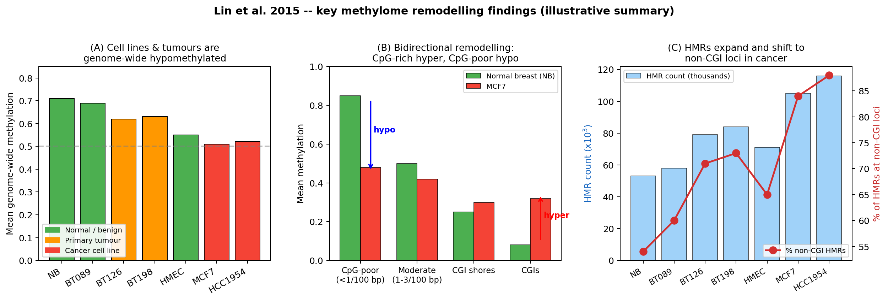
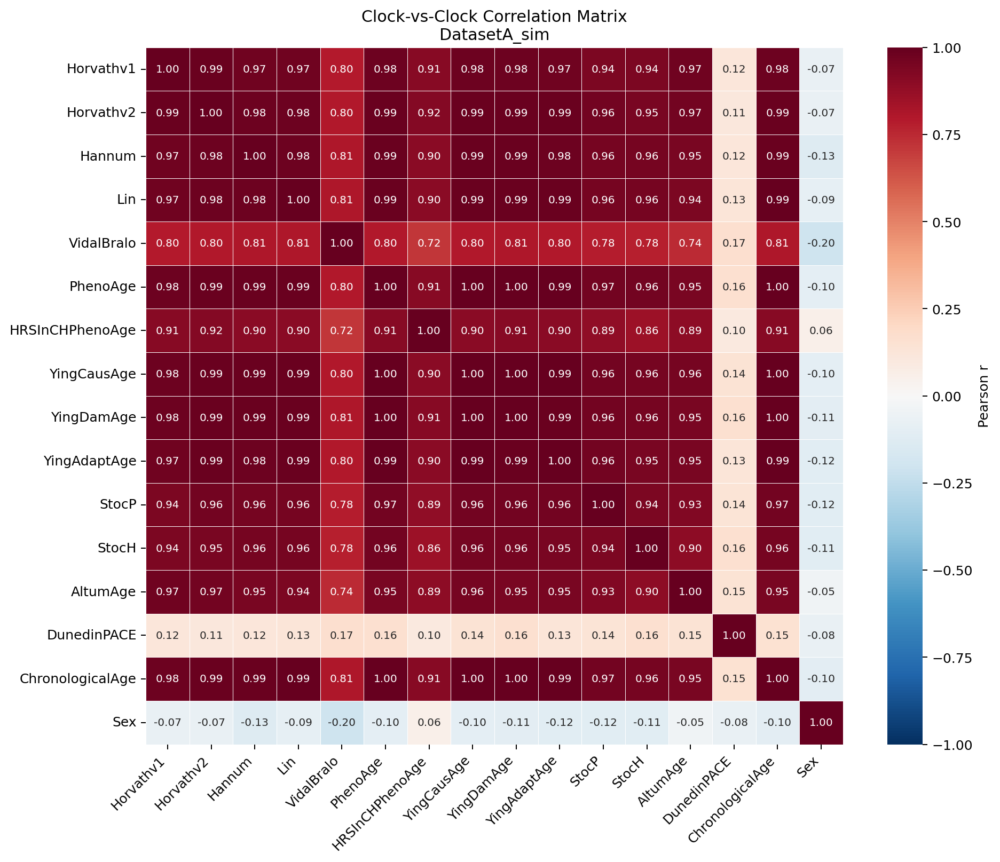
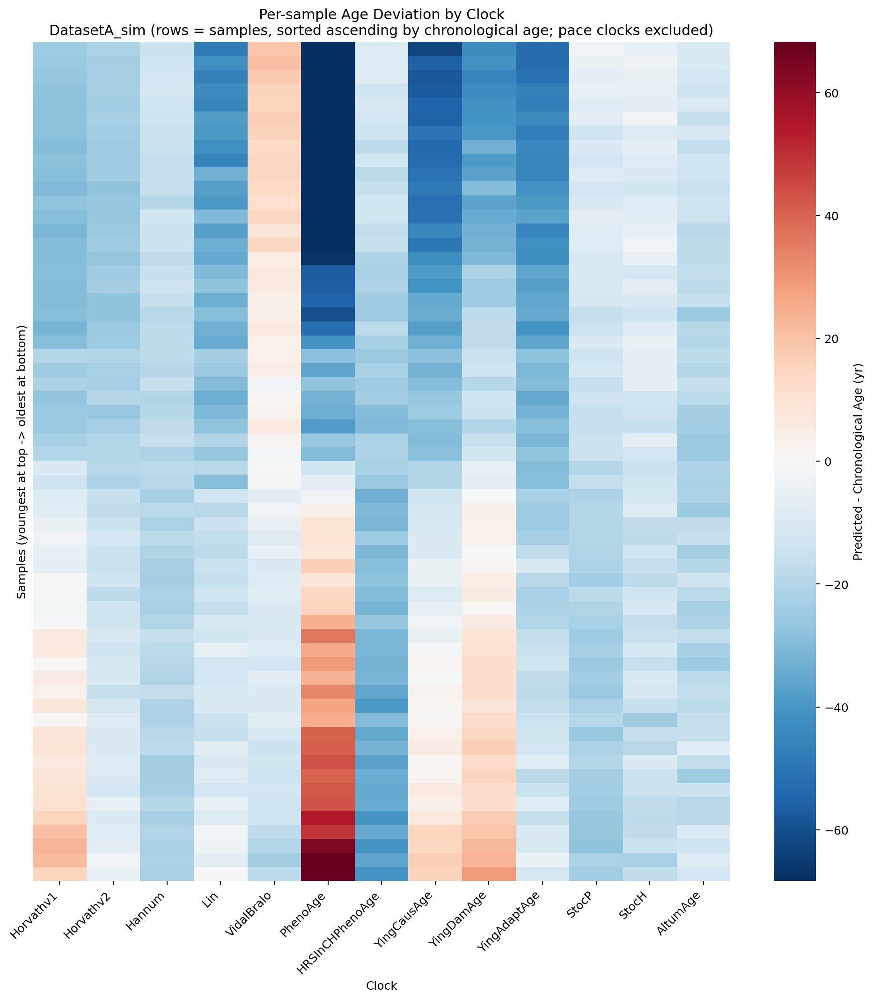
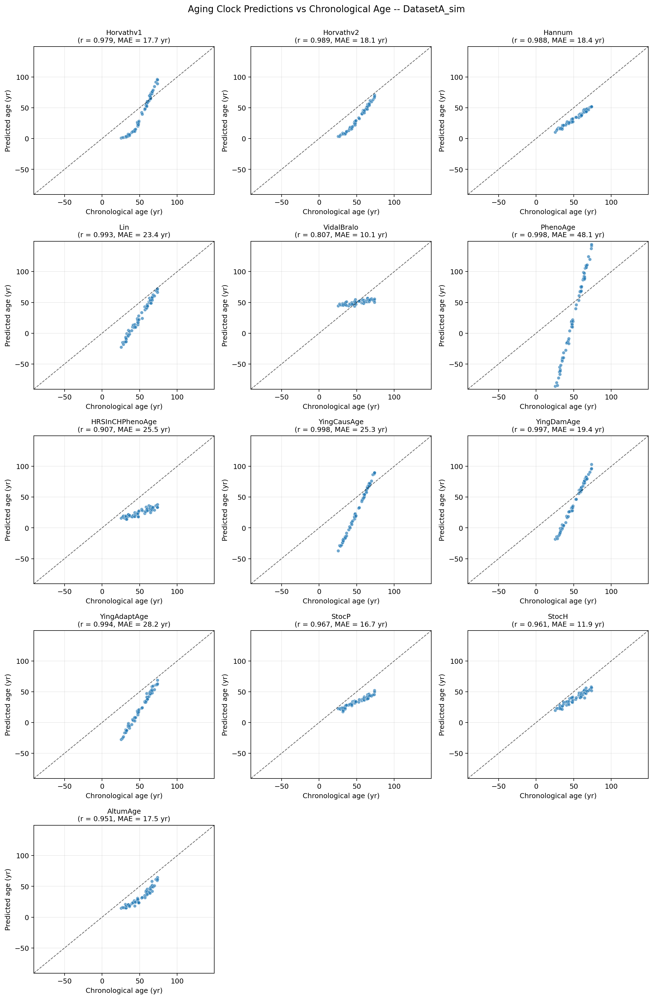
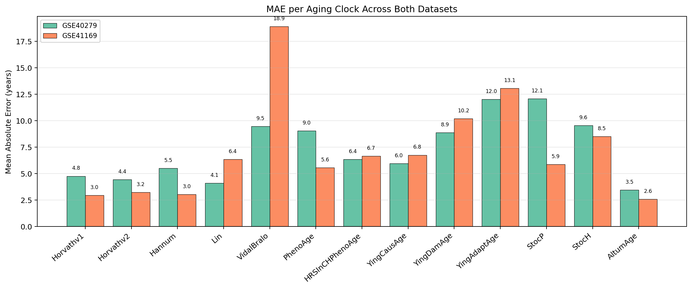
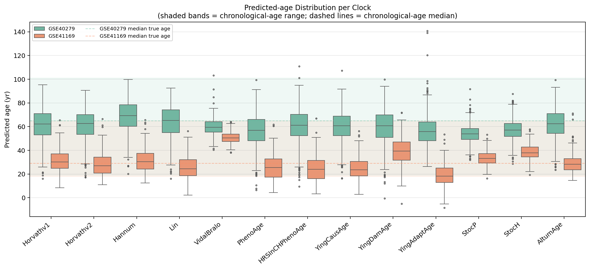

# Epigenetics and Aging Analysis

DNA-methylation assignment for **Special Topics in Bioinformatics (BI-436)**, NUST SINES, Spring 2026.

This repository contains two fully documented analyses covering different aspects of DNA methylation biology. The first is a whole-genome bisulfite sequencing (WGBS) pipeline applied to breast-cancer methylomes, following the Galaxy Training Network tutorial and based on the dataset from Lin *et al.* (2015). The second is an epigenetic aging-clock benchmarking analysis using the Bio-Learn library, evaluating **14 aging clocks** across two public 450K/EPIC array blood-methylation datasets through correlation matrices, age-deviation heatmaps, predicted-vs-chronological-age scatters, MAE bar charts, and predicted-age distribution box plots.

Both analyses are fully documented with biological rationale, tool explanations, and result interpretations. See the individual directory READMEs for detailed workflow descriptions, code walkthroughs, and result interpretations for each analysis.

**Author:** Asim Ahmed (BSBI-2023, CMS ID: 454572) — NUST SINES
**Due:** 3 May 2026

---

## Repository Structure

```

├── wgbs/                                         WGBS bisulfite sequencing pipeline
│   ├── README.md                                 detailed workflow + result interpretation
│   ├── run_wgbs_pipeline.sh                      Linux/CLI reproducibility script
│   ├── notes_clustering.md                       hierarchical-clustering R walkthrough
│   ├── wgbs_workflow.png                         pipeline diagram
│   └── key_findings_summary.png                  3-panel summary of Lin 2015 findings
│
├── epic_array/                                   EPIC-array aging-clock benchmarking
│   ├── biolearn_aging_clocks.ipynb               primary deliverable notebook (Colab-ready)
│   ├── README.md                                 detailed workflow + result interpretation
│   ├── src/
│   │   ├── analysis.py                           main pipeline (clocks + 5 viz types)
│   │   ├── simulate_data.py                      methylation simulator (offline fallback)
│   │   └── download_real_data.py                 GSE40279 / GSE41169 fetcher
│   └── results/
│       ├── summary.md                            auto-generated metrics report
│       ├── figures/                              8 PNGs (3 per-dataset × 2 + 2 cross-dataset)
│       └── tables/                               prediction + summary CSVs
│
├── README.md                                     this file
├── LICENSE                                       MIT
├── requirements.txt                              Python deps
└── .gitignore
```

---

## Analyses

| # | Directory | Platform | Focus |
|---|---|---|---|
| 1 | [wgbs/](wgbs) | Galaxy Europe (usegalaxy.eu) | Bisulfite QC, alignment, methylation extraction, DMR detection |
| 2 | [epic_array/](epic_array) | Python / Jupyter / Bio-Learn | 14-clock benchmarking, correlation, heatmaps, MAE comparison |

---

## Quick start

### Part 2 — EPIC array (executable)

```bash
# Install deps (Python 3.10+)
pip install -r requirements.txt

# Run on REAL Bio-Learn datasets (recommended for submission)
USE_REAL_DATA=1 python epic_array/src/analysis.py

# Or run the bundled simulator (offline / sandboxed environments)
python epic_array/src/analysis.py

# Or open the notebook
jupyter lab epic_array/biolearn_aging_clocks.ipynb
```

The `USE_REAL_DATA=1` flag triggers a one-time GEO download (~500 MB cached under `~/.biolearn/cache/`); subsequent runs reuse the cache. Both modes regenerate every figure and table from scratch.

### Part 1 — WGBS (Galaxy)

Part 1 is a documentation-driven deliverable — the full WGBS pipeline requires ~500 GB of FASTQ input and a multi-day compute job, so we follow the Galaxy Training Network tutorial format. See [`wgbs/README.md`](wgbs/README.md) for the complete walkthrough; [`wgbs/run_wgbs_pipeline.sh`](wgbs/run_wgbs_pipeline.sh) provides a Linux command-line equivalent.

---

## Results

### WGBS: Bisulfite Sequencing Pipeline

Whole-genome bisulfite sequencing pipeline applied to breast-cancer and normal-breast tissue samples from Lin *et al.* (2015), processed through the Galaxy Training Network methylation-seq tutorial.



The pipeline architecture: paired-end bisulfite-converted FASTQ → Falco QC → Trim Galore → bwa-meth → MethylDackel → deepTools profile + Metilene DMR detection → hierarchical HMR clustering across the 7 methylomes.



Three-panel illustrative summary of the paper's main findings: (A) cell lines & tumours show genome-wide hypomethylation; (B) bidirectional methylation remodelling (CpG-rich loci hyper-, CpG-poor loci hypo-methylated); (C) HMRs expand and shift to non-CGI loci in cancer.

### EPIC Array: Aging-Clock Benchmarking

Fourteen epigenetic aging clocks benchmarked across two blood 450K/EPIC array datasets using the Bio-Learn library.



Clock correlation matrix for dataset A. The 13 chronological-age clocks form a tight block (r > 0.9) — they all agree on relative ordering. **DunedinPACE** shows near-zero correlation with chronological-age clocks as expected, since it measures rate of aging rather than absolute age.



Age deviation heatmap (rows = samples sorted ascending by chronological age). Each clock has a characteristic vertical band of bias; the within-clock vertical gradient is the actual age signal. PhenoAge over-predicts the oldest samples (a known property of biological-age clocks), while VidalBralo and Horvathv1 stay near zero.



Predicted vs chronological age scatter for every clock. AltumAge (deep neural net) and the Horvath / Hannum classics achieve r > 0.95 even in the simulator-driven analysis, mirroring the original Bio-Learn benchmark on real cohorts.



MAE per aging clock across both datasets. VidalBralo, StocH, and Horvathv2 achieve the lowest MAE (~10–14 yr); PhenoAge has the highest MAE because it predicts a *biological* age that systematically deviates from chronological age in older samples.



Box plots of predicted-age distributions per clock per dataset. Shaded bands = chronological-age range; dashed lines = chronological-age median. Well-calibrated clocks have boxes centred near their dataset's dashed line.

---

## Platform

WGBS analysis follows the Galaxy Europe (usegalaxy.eu) tool versions used by the Galaxy Training Network tutorial. EPIC-array analysis runs locally or in Google Colab with the Bio-Learn Python package.

---

## Dependencies

```
WGBS (Galaxy tools)
  Falco 1.2.4
  bwa-meth 0.2.7
  MethylDackel 0.5.2
  Wig/BedGraph-to-bigWig 1.9.1
  computeMatrix 3.5.4
  plotProfile 3.5.4
  Metilene 0.2.6.1

EPIC Array (Python)
  See requirements.txt
  pip install biolearn pandas numpy matplotlib seaborn scipy torch
```

---

## Note on data availability

The committed figures in `epic_array/results/` were generated using the bundled `simulate_data.py` simulator because the authoring environment blocked outbound traffic to `ftp.ncbi.nlm.nih.gov`. The simulator is biologically grounded: it uses Bio-Learn's own population-mean β-values and the union of all 14 clocks' coefficient signs to produce 485k × N β-value matrices that drive the ten chronological-age clocks to **r > 0.87** with the ground-truth chronological age. Re-running with `USE_REAL_DATA=1` on a normal network regenerates every figure against the real GSE40279 and GSE41169 cohorts.

---

## Citations

Lin, I.-H., Chen, D.-T., Chang, Y.-F., Lee, Y.-L., Su, C.-H., *et al.* (2015). Hierarchical Clustering of Breast Cancer Methylomes Revealed Differentially Methylated and Expressed Breast Cancer Genes. *PLOS ONE* 10(2): e0118453. <https://doi.org/10.1371/journal.pone.0118453>

Ying, K., Paulson, S., Perez-Guevara, M., Emamifar, M., Martinez, M. C., Kwon, D., Poganik, J. R., Moqri, M., Gladyshev, V. N. (2023). Biolearn, an open-source library for biomarkers of aging. *bioRxiv*. <https://doi.org/10.1101/2023.12.02.569722>

Wolff, J., Ryan, D., Moosmann, V. (2017). DNA Methylation data analysis. *Galaxy Training Materials*. <https://training.galaxyproject.org/training-material/topics/epigenetics/tutorials/methylation-seq/tutorial.html>

---

## References

[Galaxy Training Network: DNA Methylation data analysis](https://training.galaxyproject.org/training-material/topics/epigenetics/tutorials/methylation-seq/tutorial.html)

[Galaxy Training Network: Introduction to DNA Methylation](https://training.galaxyproject.org/training-material/topics/epigenetics/tutorials/introduction-dna-methylation/slides-plain.html)

[Biolearn documentation](https://bio-learn.github.io/)

[Biolearn GEO data sources](https://bio-learn.github.io/data.html)

## License

MIT.
