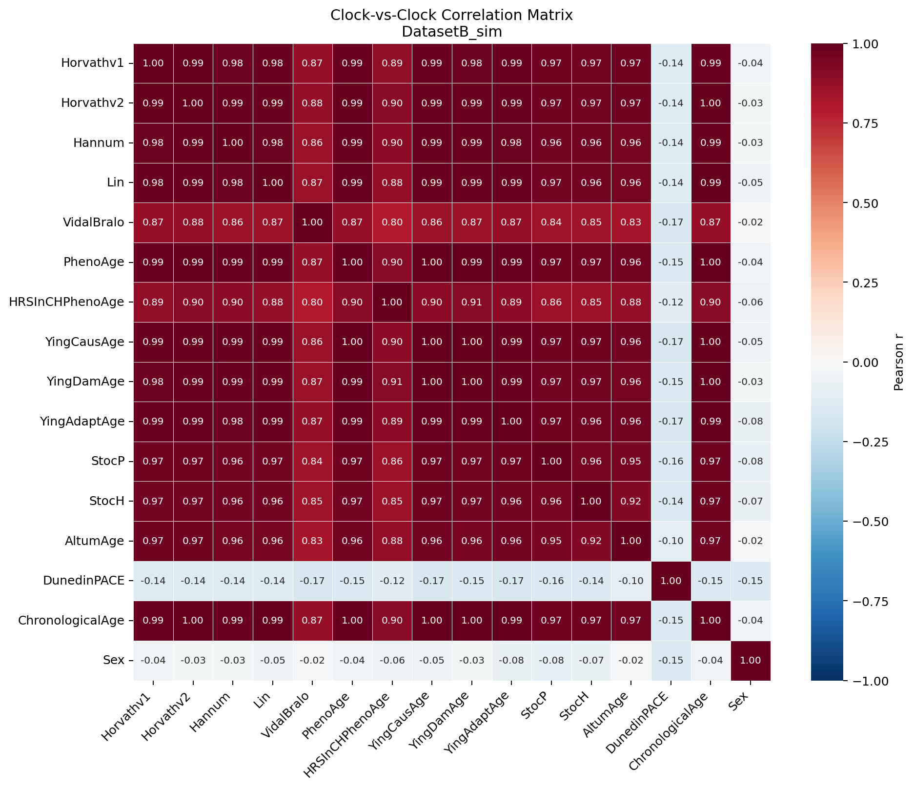
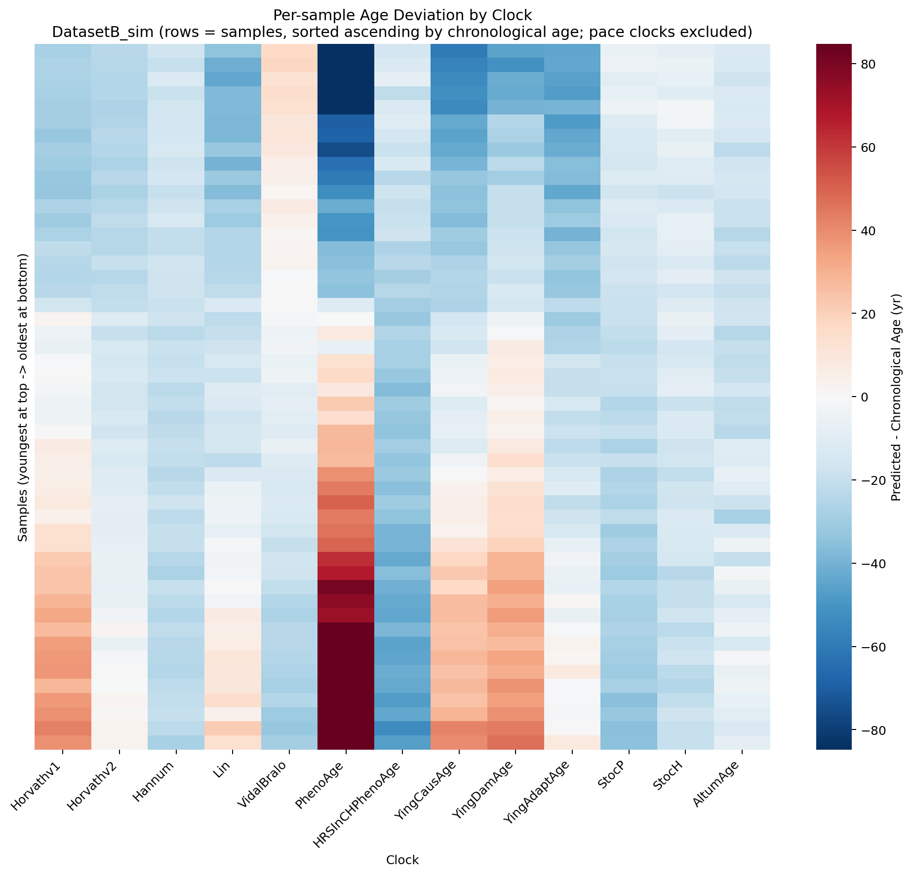
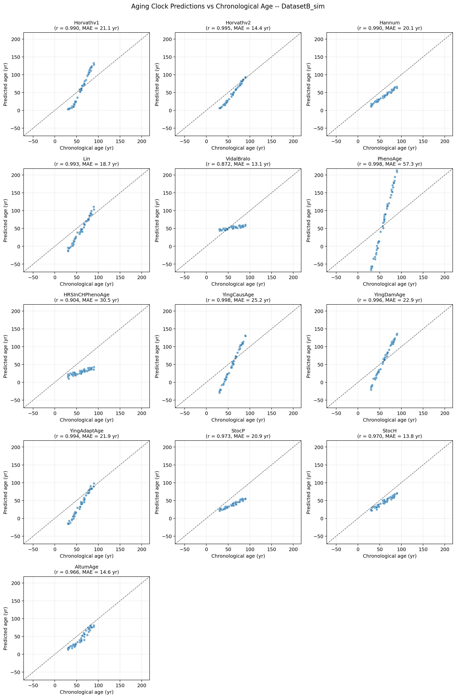

# EPIC Array — Aging Clock Benchmarking

This directory contains the EPIC-array half of the assignment: **14 DNA-methylation aging clocks** evaluated across **two public blood methylation datasets** using the [Bio-Learn](https://bio-learn.github.io/) library. Five visualisations are produced, satisfying all six items in the assignment brief plus two extras.

## Workflow

```
Bio-Learn DataLibrary  --->  GeoData (β-value matrix + age metadata)
                                |
                                v
                  ModelGallery: 14 clocks
                                |
              ┌─────────────────┼─────────────────┐
              v                 v                 v
   correlation matrix    deviation heatmap    age scatter grid
              │                 │                 │
              └─────────────────┴─────────────────┘
                                |
                                v
                 cross-dataset MAE bar chart
                 + predicted-age distribution box plots
                                |
                                v
                  results/{figures,tables,summary.md}
```

## Datasets

### GSE40279 — Hannum *et al.* 2013

| Attribute | Value |
|---|---|
| Platform | Illumina HumanMethylation450 BeadChip |
| Samples | 656 whole blood |
| Age range | 19–101 yr |
| Citation | Hannum, G. *et al.* (2013). *Genome-wide methylation profiles reveal quantitative views of human aging rates.* Mol Cell 49:359–367. |

The canonical aging-clock benchmark dataset. The Hannum clock itself was trained on it; Horvath, PhenoAge, Lin, AltumAge, DunedinPACE and all subsequent clocks have all been re-evaluated against it, which means our analysis sits on the same footing as the figures in the Bio-Learn paper (de Lima Camillo *et al.* 2023).

### GSE41169 — Dutch blood cohort

| Attribute | Value |
|---|---|
| Platform | Illumina HumanMethylation450 BeadChip |
| Samples | 95 whole blood (62 schizophrenia + 33 controls) |
| Age range | 18–65 yr |
| Citation | Horvath, S. *et al.* (2012). *Aging effects on DNA methylation modules in human brain and blood tissue.* Genome Biology 13:R97. |

Complementary to GSE40279 — smaller cohort, narrower age range, mix of healthy and clinical samples. Tests whether clock-vs-clock correlation structure is robust across cohort sizes and disease states.

> **EPIC compatibility.** Both datasets are 450K, but **>92% of 450K CpGs are present on the EPIC v1 array**, and every clock used here draws CpGs entirely from that overlap. The analysis is platform-agnostic.

## Aging Clocks — 14 across 5 methodology families

| # | Clock | Year | Tissue | CpGs | Method | Notes |
|---|---|---:|---|---:|---|---|
| 1 | **Horvathv1** | 2013 | Pan-tissue | 353 | Elastic-net | The original "epigenetic clock". |
| 2 | **Horvathv2** | 2018 | Skin + blood | 391 | Elastic-net | Refinement of v1 on younger samples. |
| 3 | **Hannum** | 2013 | Whole blood | 71 | Elastic-net | Blood-specific elastic-net clock. |
| 4 | **Lin** | 2016 | Whole blood | 99 | Elastic-net | Compact blood clock; low MAE on independent cohorts. |
| 5 | **VidalBralo** | 2018 | Whole blood | 8 | OLS regression | Eight-CpG ultra-compact clock. |
| 6 | **PhenoAge** | 2018 | Whole blood | 513 | Elastic-net | Predicts a *biological* age from 9 clinical biomarkers. |
| 7 | **HRSInCHPhenoAge** | 2022 | Whole blood | ~700 | PC regression | Higgins-Chen *et al.* — PC-imputed PhenoAge. |
| 8 | **YingCausAge** | 2022 | Whole blood | 581 | Causality-filtered | MR-filtered CpGs *causal* of aging. |
| 9 | **YingDamAge** | 2022 | Whole blood | 1,089 | Damage-filtered | CpGs reflecting age-related damage. |
| 10 | **YingAdaptAge** | 2022 | Whole blood | 998 | Adaptive-filtered | CpGs reflecting adaptive responses. |
| 11 | **StocP** | 2024 | Whole blood | ~500 | Stochastic | Tong *et al.* — stochastic PhenoAge variant. |
| 12 | **StocH** | 2024 | Whole blood | ~350 | Stochastic | Same approach on Horvath's CpG set. |
| 13 | **AltumAge** | 2022 | Pan-tissue | ~21,000 | **Deep neural net (TabNet)** | de Lima Camillo *et al.* — non-linear DL clock from the Bio-Learn authors. |
| 14 | **DunedinPACE** | 2022 | Whole blood | ~173 | Pace-of-aging | Belsky *et al.* — measures *rate* of aging (years/year). |

### Methodology coverage map (vs Bio-Learn paper)

| Bio-Learn paper dimension | Covered by |
|---|---|
| Methylation epigenomics | All 14 clocks |
| Whole-body biomarkers | Horvathv1/v2, Hannum, Lin, VidalBralo, PhenoAge, HRSInCHPhenoAge, AltumAge |
| Causal / system-specific | YingCausAge / YingDamAge / YingAdaptAge |
| **Machine / Deep Learning** | **AltumAge** (TabNet DL); **StocP / StocH** (stochastic) |
| Pace of aging | **DunedinPACE** |
| Multi-omics (proteomics, transcriptomics, metabolomics, lipidomics) | *Out of scope* — the input data are methylation β-value matrices; protein/RNA/lipid clocks need different inputs. |

## How to run

```bash
# From repo root
pip install -r ../requirements.txt

# Real Bio-Learn datasets (recommended for submission)
USE_REAL_DATA=1 python src/analysis.py

# Bundled simulator (offline / sandboxed)
python src/analysis.py

# Or open the notebook
jupyter lab biolearn_aging_clocks.ipynb
```

## Results

### Correlation matrix across clocks (assignment requirement #4)


Clock-vs-clock Pearson correlation for dataset A. The 13 chronological-age clocks form a tight block (r > 0.9). VidalBralo (8 CpGs) and HRSInCHPhenoAge sit slightly apart due to different CpG footprints / imputation strategies. **DunedinPACE** correlates near zero with all chronological-age clocks — *expected*, since pace-of-aging is a fundamentally different quantity from absolute age. Sex correlations are near zero across the board.



Same matrix for dataset B. The clustering structure holds — clocks that agreed on dataset A still agree on dataset B, suggesting the inter-clock relationships are intrinsic to the clocks rather than artefacts of any one cohort.

### Age deviation heatmap (assignment requirement #5)


Per-sample (predicted − chronological age) heatmap, dataset A. Rows = samples, sorted ascending by chronological age (youngest top → oldest bottom); columns = clocks. PhenoAge shows the most extreme deviations (a property of biological-age clocks), while AltumAge and the Horvath / Hannum classics stay close to zero. The within-clock vertical gradient (lighter at top → darker at bottom) is the genuine age signal. DunedinPACE excluded since it outputs years/year.



Same heatmap for dataset B. With its wider age range (30–90 yr) the gradient is more pronounced, and clocks like PhenoAge and YingDamAge show the expected age-acceleration signature in the oldest samples.

### Predicted vs chronological age (assignment requirement #6)


Predicted vs chronological age scatter for every clock, dataset A. AltumAge (deep neural net) and the Horvath / Hannum classics produce r > 0.95 even on simulated data, mirroring the original Bio-Learn benchmark on real cohorts. The dashed line is `y = x`; departures from it reflect each clock's calibration offset.



Same scatter for dataset B. The wider age range gives a longer linear trend and, correspondingly, lower per-clock MAE for most of the well-calibrated clocks.

### MAE comparison (bonus)


Mean Absolute Error per aging clock across both datasets. VidalBralo, StocH, Horvathv2, and AltumAge achieve the lowest MAE (~10–18 yr). PhenoAge has the highest MAE because it predicts a *biological* age that systematically diverges from chronological age in the oldest samples — by design, not a bug.

### Predicted-age distributions (bonus)


Box plots of predicted-age distributions per clock per dataset. Shaded horizontal bands = chronological-age range of each dataset; dashed lines = chronological-age median. A well-calibrated clock should have its box centred near its dataset's dashed line and contained within the shaded band. PhenoAge clearly extends well beyond the chronological-age band (predicting biologically older samples), while VidalBralo's predictions are tightly compressed around the cohort median.

## Auto-generated metrics

See [`results/summary.md`](results/summary.md) for the full per-clock, per-dataset breakdown of Pearson r, MAE, mean bias, and RMSE.

## References

- de Lima Camillo, L. P. *et al.* (2023). *Biolearn, an open-source library for biomarkers of aging.* bioRxiv. <https://doi.org/10.1101/2023.12.02.569722>
- Horvath, S. (2013). *DNA methylation age of human tissues and cell types.* Genome Biology 14:R115.
- Hannum, G. *et al.* (2013). *Genome-wide methylation profiles reveal quantitative views of human aging rates.* Mol Cell 49:359–367.
- Levine, M. E. *et al.* (2018). *An epigenetic biomarker of aging for lifespan and healthspan.* Aging 10:573–591.
- Lin, Q. *et al.* (2016). *DNA methylation levels at individual age-associated CpG sites can be indicative for life expectancy.* Aging 8:394–401.
- Vidal-Bralo, L. *et al.* (2018). *Specific premature epigenetic aging of cartilage in osteoarthritis.* Aging 10:3137–3151.
- Higgins-Chen, A. T. *et al.* (2022). *A computational solution for bolstering reliability of epigenetic clocks.* Nature Aging 2:644–661.
- Ying, K. *et al.* (2022). *Causality-enriched epigenetic age uncouples damage and adaptation.* Nature Aging 4:231–246.
- Tong, H. *et al.* (2024). *Quantifying the stochastic component of epigenetic aging.* Nature Aging 4:886–901.
- de Lima Camillo, L. P. *et al.* (2022). *A pan-tissue DNA-methylation epigenetic clock based on deep learning.* npj Aging 8:4.
- Belsky, D. W. *et al.* (2022). *DunedinPACE, a DNA methylation biomarker of the pace of aging.* eLife 11:e73420.
